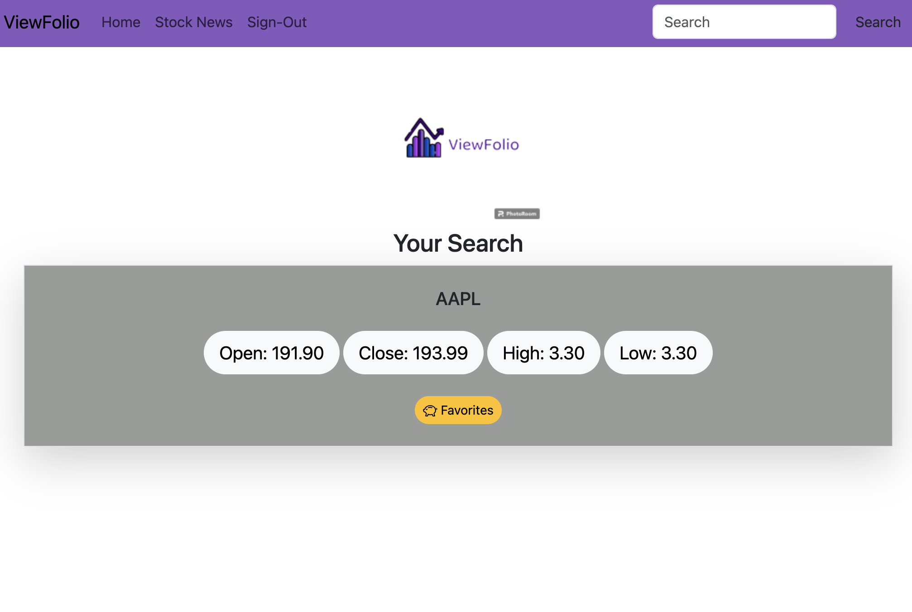

# ViewFolio
Fullstack Stock Ticker Application

## Description

This webpage was built to assist the user in tracking their favoirte stocks.  The user can monitor the priceof thet stock, open price, close price, the highest price and lowest price of the day. The stock news tab will show the top gainers and losers of the day. Using the Alphavantage API the user can view the price, change price, change percentage and volumn of the top stocks.  The packages that were used to build this application were blaze, axios, bcrypt, bootstrap icons, sequilize, express, handlebars, MySQL2, eslint, and prettier.  We made multipe API calls to the Alphavantage API to get the daily information pertaning to the searched stocks and the top gainers and losers listed on the stock news page.  

## Technologies Used 

Axios: https://axios-http.com/docs/intro

Bootstrap: https://getbootstrap.com/

APIs 
    Alphavantage: https://www.alphavantage.co/documentation/

## Installation

ViewFolio Repo URL: https://github.com/shadowfre4k/viewFolio

Heroku URL: https://secure-sands-25649-e4efe5e3aa6b.herokuapp.com/

## Usage

Once the webpage loads the user will be prompted to login or sing up if a first time user. Once the user logs in they will be taken to the home page where they can search for stocks to view pertaining to that stock for the day. The user will also be able to click the Stock News link at the top left to view stats pertaining to the top gainers and losers of the day.       

## Screenshot

## Credits

Mallorie Pinto

Vincent Jacobs

Len Zuro

Joan Brambila

## License

This project is licensed under MIT.

## Future Development

1. The user will be able to favorite a stock to follow.
2. Adding a history section on the left of the homescreen 
3. Allowing the user to trade stocks directly from the app 
4. Add alerts so the user knows when a stock price dropped or rose a certain percentage 

